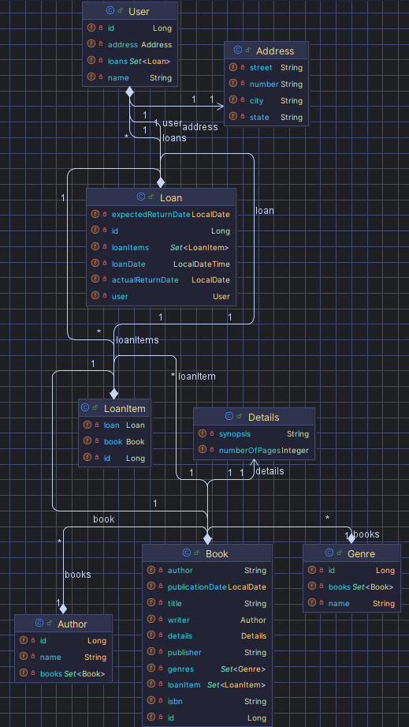

# API de Gerenciamento de Biblioteca

[](https://opensource.org/licenses/MIT)

Este é um projeto de API para gerenciar uma biblioteca, incluindo usuários, livros, empréstimos e outras funcionalidades relacionadas.

## Funcionalidades Principais

* **Gerenciamento de Usuários:** A API permite o gerenciamento de usuários, incluindo a criação, recuperação, atualização e exclusão de informações de usuários.
* **Gerenciamento de Livros:** A API permite o gerenciamento de livros, incluindo detalhes como título, autor, ISBN, data de publicação, editora, detalhes do livro (número de páginas, sinopse), gênero e escritor.
* **Gerenciamento de Empréstimos:** A API suporta o gerenciamento de empréstimos de livros para usuários, incluindo o registro da data do empréstimo, data de devolução prevista e data de devolução real.
* **Relacionamento Livro-Gênero-Escritor:** Os livros estão associados a gêneros e escritores, permitindo a organização e categorização eficientes dos livros.
* **Detalhes do Livro:** Cada livro pode ter detalhes adicionais, como o número de páginas e uma sinopse.

## Modelo de Dados

O modelo de dados da API é composto pelas seguintes entidades principais:



* **Usuário:** Representa um usuário da biblioteca.
    * `id`: Identificador único do usuário.
    * `name`: Nome do usuário.
    * `address`: Endereço do usuário (rua, número, cidade, estado).
* **Livro:** Representa um livro na biblioteca.
    * `id`: Identificador único do livro.
    * `title`: Título do livro.
    * `author`: Autor do livro.
    * `isbn`: ISBN do livro.
    * `publicationDate`: Data de publicação do livro.
    * `publisher`: Editora do livro.
    * `details`: Detalhes do livro (número de páginas, sinopse).
    * `genres`: Gêneros do livro.
    * `writer`: Escritor do livro.
* **Empréstimo:** Representa um empréstimo de um livro para um usuário.
    * `id`: Identificador único do empréstimo.
    * `loanDate`: Data em que o livro foi emprestado.
    * `expectedReturnDate`: Data de devolução prevista.
    * `actualReturnDate`: Data de devolução real (opcional, para controlar devoluções).
    * `user`: Usuário que pegou o livro emprestado.
    * `loanItems`: Itens do emprestimo
* **Gênero:** Representa o gênero de um livro.
    * `id`: Identificador único do gênero.
    * `name`: Nome do gênero.
* **Escritor:** Representa o escritor de um livro.
    * `id`: Identificador único do escritor.
    * `name`: Nome do escritor.
* **DetalhesDoLivro**: Representa detalhes adicionais de um livro.
     * `numberOfPages`: número de páginas do livro
     * `synopsis`: sinopse do livro
       
## Como Usar a API
  
  A API fornece endpoints para realizar várias operações nas entidades do modelo de dados. Alguns exemplos incluem:

  `GET` /users: Recupera todos os usuários.

  `GET` /users/{id}: Recupera um usuário específico por ID.

  `POST` /users: Cria um novo usuário.

  `PUT` /users/{id}: Atualiza um usuário existente.

  `DELETE` /users/{id}: Exclui um usuário.

  `GET` /books: Recupera todos os livros.

  `GET` /books/{id}: Recupera um livro específico por ID.

  `POST` /books: Cria um novo livro.

  `PUT` /books/{id}: Atualiza um livro existente.

  `DELETE` /books/{id}: Exclui um livro.

  `GET` /loans: Recupera todos os empréstimos.

  `GET` /loans/{id}: Recupera um empréstimo específico por ID.

  `POST` /loans: Cria um novo empréstimo.

  `PUT` /loans/{id}: Atualiza um empréstimo existente.

  `DELETE` /loans/{id}: Exclui um empréstimo.


## Exemplo de Retorno de Empréstimo

O exemplo fornecido ilustra a estrutura de um retorno de empréstimo:

```json
{
    "id": 1,
    "loanDate": "2024-05-01T10:00:00",
    "expectedReturnDate": "2024-05-15",
    "actualReturnDate": "2024-05-17",
    "user": {
        "id": 1,
        "name": "Diego",
        "address": {
            "street": "cross street",
            "number": "17",
            "city": "Marlborough",
            "state": "Massachupetis"
        }
    },
     "loanItems": [
        {
            "id": 1,
            "book": {
                "id": 1,
                "title": "1984",
                "author": "George Orwell",
                "isbn": "978-0451524935",
                "publicationDate": "1949-06-08",
                "publisher": "Secker & Warburg",
                "details": {
                    "numberOfPages": 328,
                    "synopsis": "Um romance distópico sobre um futuro onde o governo controla todos os aspectos da vida das pessoas."
                },
                "genres": [
                    {
                        "id": 3,
                        "name": "Fantasia"
                    }
                ],
                "writer": {
                    "id": 1,
                    "name": "George Orwell"
                }
            }
        }
    ]
}

